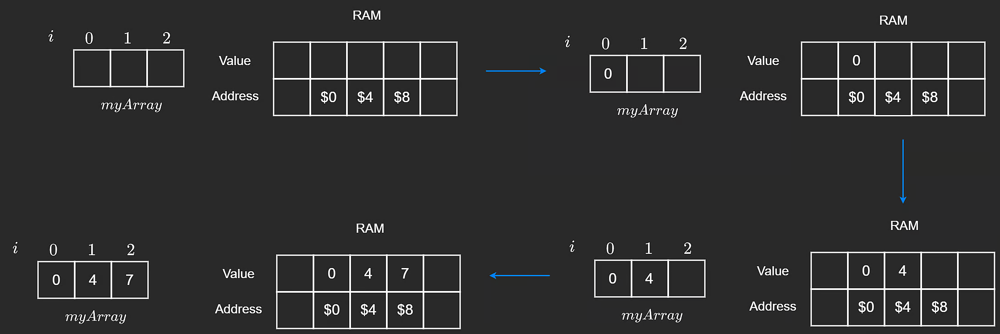
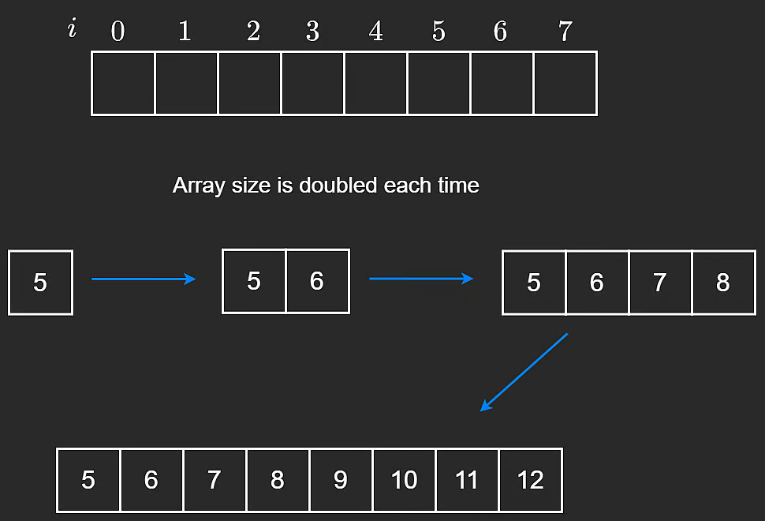

# Dynamic Arrays
Dynamic Arrays are much more common and useful because of their ability to be resized. In JavaScript and Python, these are the default — they are not strictly typed languages.

The difference between static and dynamic arrays is that we don’t have to specify a size upon initialization.

In different languages, dynamic arrays may be assigned a default size - Java being `10` and C# being `4`. Regardless, these are automatically resized at runtime.

## Mechanics of dynamic arrays
When inserting into a dynamic array, the operating system finds the next empty space and pushes the element into it. For the sake of an example, let’s take an array of size 
`3`and push elements into it until we run out of space. The pseudocode and visual below demonstrate this.
```python
# Insert n in the last position of the array
def pushback(self, n):
    if self.length == self.capacity:
        self.resize()
        
    # insert at next empty position
    self.arr[self.length] = n
    self.length += 1
```


Since the array is dynamic, adding another element when we run out of capacity is achieved by copying over the values to a new array that is double the original size - this means that the resulting array will be of size `6` and will have new space allocated for it in memory. The following visual and pseudocode demonstrates this.

```python
def resize(self):
   # Create new array of double capacity
   self.capacity = 2 * self.capacity
   newArr = [0] * self.capacity 

   # Copy elements to newArr
   for i in range(self.length):
       newArr[i] = self.arr[i]
   self.arr = newArr
```

>When all the elements from the first array have been copied over, it does not make sense to keep it in memory - this space will be deallocated.

This operation will run in amortized `𝑂(1)`. Amortized time complexity is the average time taken per operation, that once it happens, it won’t happen again for so long that the cost becomes “amortized”. This makes sense because it is not always that the array needs to be resized, in which case we would perform `𝑂(𝑛)` operations.

## Why double the capacity?
Let’s dig a little bit deeper into why we double the size of the initial array when we run out of space. This can be proven mathematically, so let’s go over a high level overview. Don't worry, we will not be using any fancy equations.

The visual below shows a resulting array of size `8`. Now imagine that we wanted to dynamically fill it up and we started with a size `1` array. We would add `5`, double the space to add `6`, double that space to add `7` and `8`, double that space to add `9`, `10`, `11` and `12`.



The size of the above array went from `1 -> 2 -> 4 -> 8.`

And this makes sense because in order to create the resulting array observed in the visual, we had to create 4 spaces, and then insert `4` elements, which is a total of `8` operations. Additionally, we also have to take into consideration the sum of all the operations that occured before the last one since we would not have gotten to the resulting array without these operations.

The pattern here is that the last term (the dominating term) is always greater than or equal to the sum of all the terms before it. In this case, 
`1+2+4=7`, and `7<8`. Add in the `8` to the `7`, we get a total of 15 operations to create the resulting array of size `8`. Generally, the formula is that for any array size `n`, it will take at most `2n` operations to create, which would belong to`O(n)`.

>When we are talking about the asymptotic analysis, we are more concerned with an unusually large input size, meaning in the worst case, if our input size was extremely large, say, we built an array of size 150,000, asymptotically, there would be no difference between `O(2n)` and `O(n)` because if the algorithm performs exactly `2n` operations, it surely performs at least `O(n)` operations. Therefore, we drop the constants.

## Closing Notes
| Operation | Big-O Time | Notes |
|---|---|---|
| Access | O(1) | - |
| Insertion | O(1)* | O(n) if insertion is in the middle, since shifting is required |
| Deletion | O(1)* | O(n) if deletion is in the middle, since shifting is required |

## Other operations in pseudocode
```python
# Remove the last element in the array
def popback(self):
    if self.length > 0:
        self.length -= 1

# Get value at i-th index
def get(self, i):
    if i < self.length:
        return self.arr[i]
    # Here we would throw an out of bounds exception

# Insert n at i-th index
def insert(self, i, n):
    if i < self.length:
        self.arr[i] = n
        return
    # Here we would throw an out of bounds exception       

def print(self):
    for i in range(self.length):
        print(self.arr[i])
    print()
```