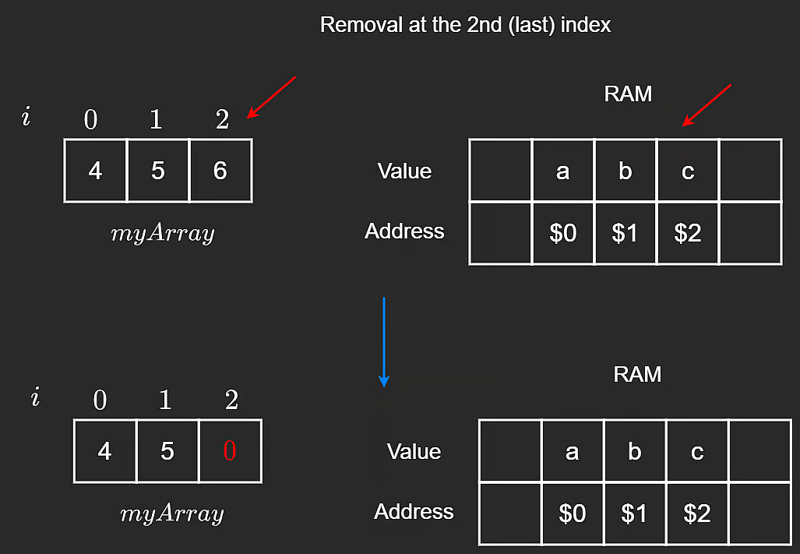
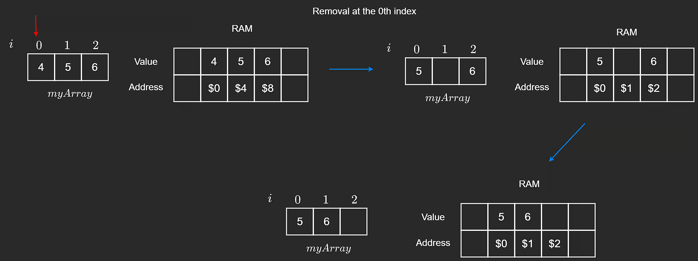
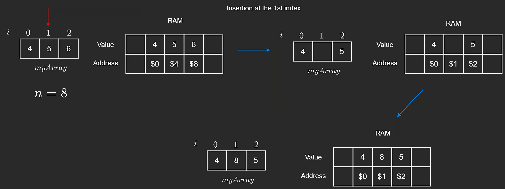

# Static Arrays

To recall, arrays are a way of storing data contiguously. In strictly typed languages like Java, C++, C# etc, arrays have an allocated size when initialized. This means that the size of the array cannot change after its initialization.

These are known as static arrays. Loosely typed languages such as Python and JavaScript do not have static arrays, which we will discuss in the next chapter.

Arrays are a very popular topic in coding interviews since they are one of the most fundamental data structures. In fact, there are many data structures and algorithms which use an array in their underlying implementation - we will discuss these later in the course. As such, it is essential to know the basic operations that can be performed on an array. The most common operations are:

- Reading
- Deletion
- Insertion

## Reading from an array

Array elements are accessed through indices, which start at `0` in most languages. Reading from an array is as simple as accessing the index. For this example, we will be initializing an array of size `3` called `myArray`. Below is some example code to demonstrate a read operation.

```python
# initialize myArray
myArray = [1,3,5]

# access an arbitrary element, where i is the index of the desired value
myArray[i]
```

As long as the index of an element is known, the access is instant. This is because each index of myArray is mapped to an address in the RAM. Regardless of the size of the input array, the time taken to access our element – given that the index is known – will always be unaffected. We refer to this operation as `𝑂(1)`in terms of time complexity.

>There is a common confusion that `𝑂(1)` is always fast. This is not the case. There could be `1000`operations and the time complexity could still be `𝑂(1)`. Similarly, an algorithm with
`5` operations could also have a complexity of `𝑂(1)`. All `𝑂(1)` really means is that the number of operations is constant relative to the input size.

## Traversing through an array

Traversing refers to iterating through all the values in the array. We can choose to traverse through any part of the array we like. Below is code showing the traversal process from the start to the end of myArray.

```python
for i in range(len(myArray)):
   print(myArray[i])

# OR

i = 0
while i < len(myArray):
   print(myArray[i])
   i += 1
```

> `length-1` is the last accessible index of the array. The last index of the array is `𝑛−1` if `𝑛` is the size of the array. If the size of our array is `3`, the last accessible index is `2`.

## Deleting from an array

### Deleting from the end of the array

In strictly typed languages, all array indices are filled with `0s` or some default value upon initialization, denoting an empty array. When we want to remove an element from the last index of an array, setting its value to `0 / null or -1` does the job. While it is not being "deleted" per se, this overwriting denotes an empty index. We will also reduce the length by 1 since we have one less element in the array after deletion. The code below demonstrates the concept using `[4, 5, 6]` as an example.

```python
# Remove from the last position in the array if the array
# is not empty (i.e. length is non-zero).
def removeEnd(arr, length):
    if length > 0:
        # Overwrite last element with some default value.
        # We would also consider the length to be decreased by 1.
        arr[length - 1] = 0
```


> `6` is deleted/overwritten by either `0` or `−1` to denote that it does not exist anymore. Length is also decremented by `1`.

## Deleting at an ith index

Using the same instance of myArray from the previous example, let’s say that instead of deleting at the end, we wanted to delete an element at a random index i. Would we be able to perform this in `𝑂(1)`? We could just replace it with a 0 and call it a day. But this would break the contiguous nature of our array.

Notice that we did not worry about having to maintain a contiguous order when deleting at the last index but now we have to. Okay, so how do we achieve this? Given the target index `i`, we can iterate from `i + 1` until the end of the array and shift each element `1` position to the left. In the worst case, we will need to shift all of the elements to the left.

```python
# Remove value at index i before shifting elements to the left.
# Assuming i is a valid index.
def removeMiddle(arr, i, length):
    # Shift starting from i + 1 to end.
    for index in range(i + 1, length):
        arr[index - 1] = arr[index]
    # No need to 'remove' arr[i], since we already shifted
```



>In the worst case, `𝑛−1` shifts may be required. Therefore, the code above is 𝑂(𝑛).

## Insertion

### Inserting at the end of the array

Since we can always access the last index of the array, inserting an element at the end of an array is `𝑂(1)` time. Below is the code demonstrating the concept.

```python
# Insert n into arr at the next open position.
# Length is the number of 'real' values in arr, and capacity
# is the size (aka memory allocated for the fixed size array).
def insertEnd(arr, n, length, capacity):
    if length < capacity:
        arr[length] = n
```

> `length` is the number of elements inside the array whereas `capacity` refers to the maximum number of elements the array can hold.

### Inserting at the `ith` index

Inserting at an arbitrary index `i` is a little bit more tricky. Given the state of `myArray = [4, 5, 0]` (where the last index is empty), if we are required to insert at index `1`, or `0`, we cannot overwrite because we would lose our current values. To insert, we will need to shift all values one position to the right. Below is the code and visual demonstrating this.

```python
# Insert n into index i after shifting elements to the right.
# Assuming i is a valid index and arr is not full.
def insertMiddle(arr, i, n, length):
    # Shift starting from the end to i.
    for index in range(length - 1, i - 1, -1):
        arr[index + 1] = arr[index]

    # Insert at i
    arr[i] = n
```


> The visual above demonstrates that shifting occurs prior to insertion to ensure values are not overwritten.

## Closing Notes

This is not the last we will see of arrays. They will pop up time and time again and the operations we discussed above are absolutely critical for solving a lot of interview problems. In fact, there are some easy leetcode problems where the key to solving the problem is knowing one of these operations.

Take a look at the summarized time complexity chart below and have a go at solving the Suggested Problems for this lesson. These are not mandatory and you can move forward without doing them. However, they will solidify your understanding even further and help you feel more confident as you progress through the course.

| **Operation** | **Big-O Time** | **Notes** |
| :---: | :---: | :---: |
| Reading | O(1) | |
| Insertion | O(n)* | If inserting at the end of the array, 𝑂(1) |
| Deletion | O(n)* | If deleting at the end of the array, 𝑂(1) |
